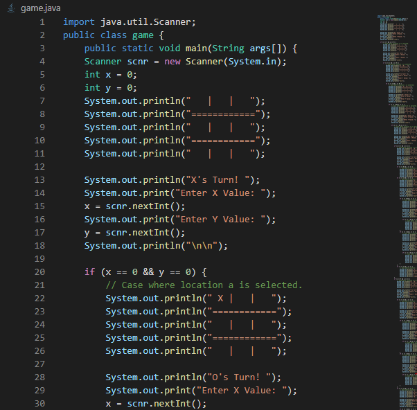

# Tic-Tac-Toe Brute Force Generator

## Overview
This program generates a brute force implementation of Tic-Tac-Toe without using lists, loops, methods, or classes. The generated code explores all possible game states through only if statements.
Here is a screenshot of the end product. It is 200 megabytes and 6771046 lines of code.

## Usage
1. Clone or download the repository.
2. Run the `bruteforce.java` script to generate the Tic-Tac-Toe brute force program.
3. The generated program will be saved as `game.java`.
4. Execute `game.java` as desired.

## Warnings
The output file, at least currently, is just shy of seven million lines of code. This currently isn't executable through traditional methods due to java byte limits, which I will attempt to address in the future.
